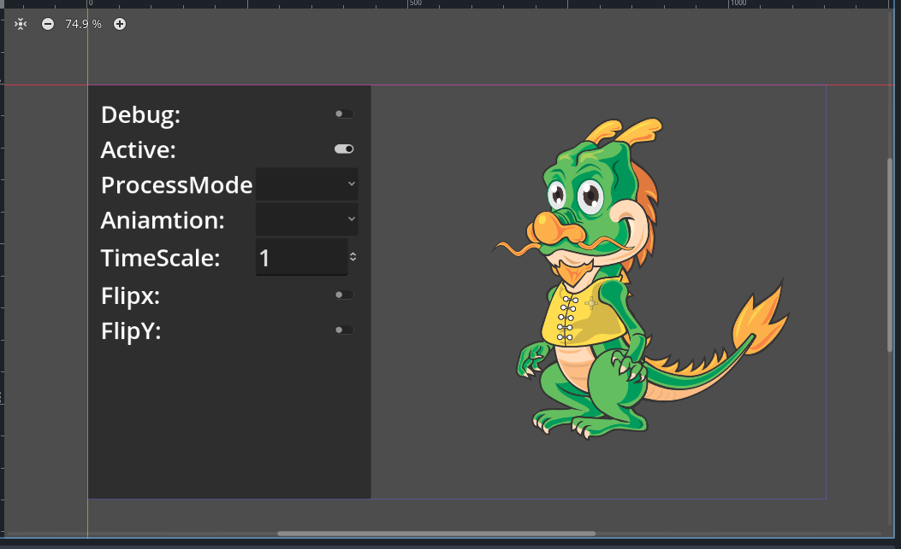

# Godot-DragonBones Plugin


[点击查看中文说明](README.zh.md)。

A GDExtension plugin to add DragonBones for Godot.



## Links

* Godot: <https://godotengine.org>
* DragonBones: <http://dragonbones.com>
* A simple demo from @blurymind: <https://github.com/blurymind/godot4-dragonbones-demo-animations-and-slots/tree/main>.

## Support Versions

* Godot 4.2 +
* DragonBones Pro 5.6

## Get plugin

1. Download from [release page](https://github.com/Daylily-Zeleen/Godot-DragonBones/releases).
2. Download from Assets Library.
3. Clone this repo and compile by yourself.

## How to compile

1. Clone this repo with submodules.
2. Ensure you have "python", "Scons", and a appropriate c++ compiler.
3. Navigate to the root of local repo, run compile command, for example:
   For debug:

   ```shell
   scons target=template_debug debug_symbols=yes
   ```

   For release:

   ```shell
   scons target=template_release
   ```

   Please refer the build system system of [godot-cpp](https://github.com/godotengine/godot-cpp.git) for more compile options.

4. If compiling is successfully, you can get the compiled plugin in `demo/addons/godot_dragon_bones.daylily-zeleen`.

## Run "demo" project

**The "master" branch has not contains compiled libraries, "demo" project can't be run correctly if you clone this branch or download it as zip archive and run it directly!**

To run "demo" project, here have 3 way:

1. Compile this plugin by following the previous part that "[How to compile](#how-to-compile)".
2. Download appropriate archive from [release page](https://github.com/Daylily-Zeleen/Godot-DragonBones/releases), and plug it into "demo" project.
3. Open "demo" project directly, ignore errors and warnings, goto "Asset Library", use "Godot-DragonBones" as keyword to search this plugin and install it, than reboot the editor.

## Export

1. Web: "Extensions Support" is required; "Thread Support" is requred if you use the precompiled plugin.

## Contents

This repository is improved from [gddragonbones](https://github.com/sanja-sa/gddragonbones).

1. Change to GDExtension for Godot 4.x.
2. Implement a import plugin to import DragonBones files automatically.
3. Imported Resource is `DragonBonesFactory`:
   1. One factory can contain multi DragonBones data and Atlas data files.
   2. Can select DragonBones data and skin which are in factory to instantiate in `DragonBones` node.
   3. If detect DragonBones assets (for example, xxx_ske.json/dbbin and xxx_tex.json) in editor, it will generate a factory resource(xxx_ske.dbfactory) at the same folder (this is disabled by default, you can turn it on in project settings by setting `Godot Dragon Bones/auto_generate_dbfactory` to true).
4. `DragonBonesArmatureView`  node:
   * The display node of DragonBones armature.
   * You can get its `DragonBonesArmature` instance by `get_armature()`.
5. `DragonBonesArmature`  node:
   * **Instantiated by `DragonBonesArmatureView` node which according to `DragonBonesFactory`, don't instantiate it by yourself.**
   * **Don't free by yourself, it will lead to crash!!**
   * In editor, a proxy property in `DragonBonesArmatureView` node, which it's type is `DragonBonesArmatureProxy`, name is "armature", will be indicated as the `DragonBonesArmature` node. If the armature have child armatures, it will have a "sub_armatures" property in `DragonBonesArmatureProxy`.
6. `DragonBonesArmatureProxy` **is editor use only!! Don't instantiate by yourself, and don't access relevant objects/properties, They are unavailable in release build.**
7. Can access `DragonBonesSlot` and `DragonBonesBone` to do some advance operations through `DragonBonesArmature` (but this is lack of test.).
8. I have not time to write a further description, please refer source code in "src/" for more details.

## Others

If this plugin can help you, please consider to [buy me a coffee](https://afdian.com/a/Daylily-Zeleen).

I'm not familiar with DragonBones, so there maybe have some wrong concepts in my code.
This repo is create for my personal project, and it is useful enough, so I think I will not do more optimize anymore.
Of course, if I encounter bug, I will try to fix it.
If you have any improvement/repair, welcome to commit your pull request.
