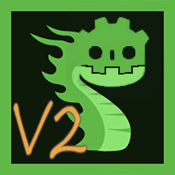
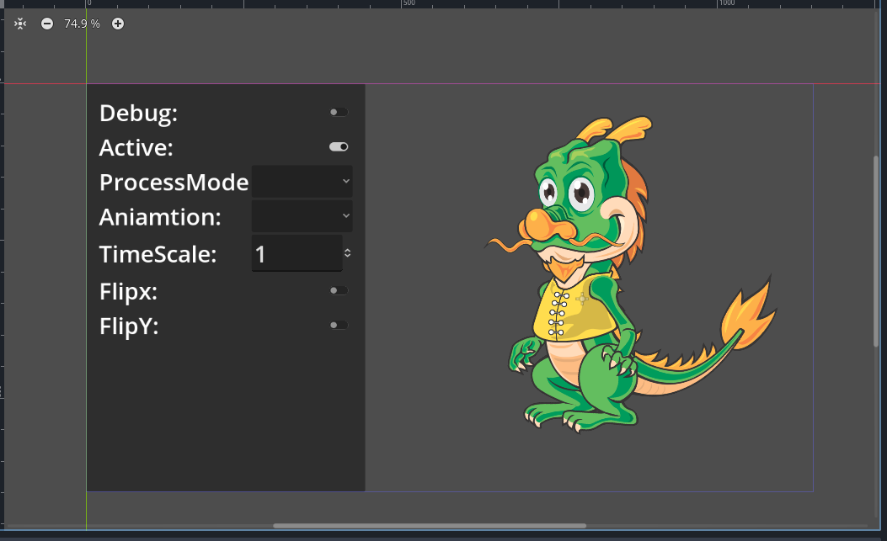

# Godot-DragonBones Plugin



[Click here to refer English readme](README.md).

一个为 Godot 添加 DragonBones 功能的 GDExtension 插件。



## 相关连接

* Godot: <https://godotengine.org>
* DragonBones: <http://dragonbones.com>
* 一个来自@blurymind的简单演示: <https://github.com/blurymind/godot4-dragonbones-demo-animations-and-slots/tree/main>.

## 支持的版本

* Godot 4.2 以上(可以尝试切换子模块godot-cpp来编译4.1的gdextension)
* DragonBones Pro 5.6

## 获取插件

1. 从发布页面下载最新的发布版。
2. 克隆该仓库自行编译。

## 如何编译

1. 与子模块一并克隆。
2. 确保你的开发环境中有"python", "Scons",以及一个合适的c++编译器。
3. 导航至本地仓库的根目录，运行编译命令，以下命令仅作参考:
   Debug:

   ```shell
   scons target=template_debug debug_symbols=yes
   ```

   Release:

   ```shell
   scons target=template_release
   ```

   更多编译选项请参考[godot-cpp](https://github.com/godotengine/godot-cpp.git)的编译系统。

4. 如果编译成功的话，你将可以在`demo/addons/godot_dragon_bones.daylily-zeleen`获取到编译好的插件。

## 运行示例项目

**"master"分支不包含编译好的库，直接克隆或作为zip档下载是无法直接运行”demo“中的示例！**

为了正常运行自带的示例，有以下3种方式：

1. 根据上一Part"[如何编译](#如何编译)"进行编译。
2. 从[发布页面](https://github.com/Daylily-Zeleen/Godot-DragonBones/releases)下载合适的发布版本，并安装到"demo"项目中。
3. 打开"demo"文件夹中的工程，忽略错误与警告，到 Asset Library 中使用 "Godot-DragonBones" 作为关键词搜索该插件并安装，再重启编辑器即可。

## 说明

该仓库改进自[龙骨模块](https://github.com/sanja-sa/gddragonbones)。

## 关于导出

1. Web: “扩展支持”必须勾选上。如果您使用的是预编译的库则“线程支持”也必须启用。

### 改进内容

1. 改为4.x用的GDExtension。
2. 实现编辑器导入插件以供自动导入龙骨相关文件。
3. 导入资源为`DragonBonesFactory`:
   * 单个工厂资源可以指定多个龙骨数据和图集描述数据文件
   * 可在`DragonBonesArmatureView`节点中指定要从`DragonBonesFoctory`实例化的龙骨数据名称和相应的皮肤名称
   * 如果识别到合适的龙骨资源(xxx_ske.json/dbbin 与 xxx_tex.json)时将在同目录下生成对应的工厂资源文件(xxx_ske.dbfactory)(默认关闭，可在项目设置中使用`Godot Dragon Bones/auto_generate_dbfactory`进行开启)
4. `DragonBonesArmatureView`节点:
   * 龙骨 Armature 的显示节点。
   * 可通过`get_armature()`获取`DragonBonesArmature`实例。
5. `DragonBonesArmature`:
   * **由`DragonBonesArmatureView`根据设定从`DragonBonesFoctory`进行实例化，不应该手动创建**。
   * 在编辑器中,作为`DragonBonesArmatureView`的"armature"属性以`DragonBonesArmatureProxy`类型进行设置,如果有子Armature，则会用有一个"sub_armatures"属性可供编辑（所有一切编辑设置将会保存在场景数据中，实例化时将被正确设置倒相应的`DragonBonesArmature`上）。
   * **千万不要手动释放！否则将导致崩溃！**
6. `DragonBonesArmatureProxy`**仅供编辑器使用，不要自行实例化，也不要访问相关对象（如`DragonBonesArmatureView`的"armature"与`DragonBonesArmatureProxy`的"sub_armatures"属性。）**
7. 可从`DragonBonesArmature`访问其中的`DragonBonesSlot`和`DragonBonesBone`进行一些高级操作（该部分没有测试，个人项目没有需求）。
8. 没有时间编写更详细的说明，具体请翻看"src/"下的源码。

## 其他

如果这个插件能帮到你还请为我[充电](https://afdian.com/a/Daylily-Zeleen)。

该仓库为个人项目使用，反正龙骨也已经跑路了，仅供给想在Godot中使用现存龙骨资源的人。
本人对龙骨中的概念也并不熟悉，是翻看源码一点改的，如果有些依赖关系搞混了也请多包涵。
改进的内容也已经大大超出我个人所需了，应该不会再附加什么改进了。
不过仍然欢迎提交修复和改进pr。
